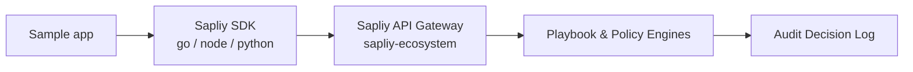

```
███████╗ █████╗ ██████╗ ██╗     ██╗   ██╗ ██╗   ██╗
██╔════╝██╔══██╗██╔══██╗██║     ██║   ██║ ╚██╗ ██╔╝
███████╗███████║██████╔╝██║     ██║   ██║  ╚████╔╝
╚════██║██╔══██║██╔══██╗██║     ██║   ██║   ╚██╔╝
███████║██║  ██║██║  ██║███████╗╚██████╔╝    ██║
╚══════╝╚═╝  ╚═╝╚═╝  ╚═╝╚══════╝ ╚═════╝     ╚═╝
```

# Sapliy Examples

Sample applications demonstrating how to integrate with the Sapliy AI-Native Financial Operations Intelligence Layer — in Go, Python, and Node.js.

> **Sapliy is an AI-native Financial Operations Intelligence Layer that turns business goals into reliable, explainable, auditable financial outcomes — by orchestrating the systems companies already run (Stripe, PayPal, Paddle, HubSpot, Xero), not replacing them.**

| Badge | |
|---|---|
| Languages | Go 1.25 · Python 3 · Node.js |
| License | [](https://opensource.org/licenses/MIT) |
| SDKs | `github.com/sapliy/sapliy-sdk-go` · `@sapliyio/fintech` · `sapliyio-fintech` |

---

## What is this?

Working, runnable examples that show real Sapliy patterns in each of the three official SDK languages. Two kinds of samples live here:

1. **Operational Playbook examples** — dependency-free, in every language, demonstrating the MVP playbook engine's *sane defaults* (dunning retry schedule + refund-approval policy gate).
2. **Application servers** — HTTP/Express/Flask services wired to the Sapliy SDKs for payment intents, webhooks, and event processing.

## Key features

- **Playbook demos** — print the Revenue Recovery & Dunning schedule and a refund-approval decision with zero dependencies (stdlib only)
- **Payment intent + webhook server** (Go) — `/charge` and `/webhook` endpoints using the Go SDK
- **Checkout server** (Node.js) — Express + `@sapliyio/fintech` (`npm start`)
- **Flask webhook handler** (Python) — `sapliyio-fintech` + Flask
- **Event processor** (Go) — polls and processes events with the Go SDK

## Operational Playbooks — dunning & refund decisions (all languages)

A dependency-free demonstration of the **Revenue Recovery & Dunning** retry schedule (first retry at +5h, then +48h steps through days 3/5/7, email channel, magic-link) and the **Refund Approval** policy gate (> $1,000 → manager approval, 90-day window). The defaults mirror `sapliy-ecosystem/internal/playbook`.

**Go** (stdlib only):

```bash
cd go
go run ./dunning
```

**Python** (stdlib only):

```bash
cd python
python3 dunning.py
```

**Node.js** (no deps):

```bash
cd node
node dunning.js
```

All three print the same output:

```text
[1] Revenue Recovery & Dunning — retry schedule
First retry:      +5h (~22% recovery expected)
Second retry:     +53h
Third retry:      +101h
Final retry:      +96h
Max retries:      4
Channels:         email
Magic-link dunning: true

[2] Refund approval — policy gate decision
Refund amount:    $1,250.00 (125000 cents)
Days since charge: 45
Decision:         REQUIRE APPROVAL — over $1,000 manager-approval threshold
```

## Application servers

### Go — payment intents + webhook server (`/go`)

A backend service using the Go SDK (`github.com/sapliy/sapliy-sdk-go`):

```bash
cd go
go mod tidy
go run .            # serves :3000 with /charge and /webhook
```

### Go — event processor (`/go/event_processor`)

Polls and processes events with the Go SDK:

```bash
cd go
go run ./event_processor
```

### Node.js — checkout server (`/node`)

A complete Express checkout flow using the Node.js SDK (`@sapliyio/fintech`):

```bash
cd node
npm install
npm start           # http://localhost:3000
```

### Python — webhook handler (`/python`)

A Flask app that verifies and processes webhook events using `sapliyio-fintech`:

```bash
cd python
pip install -r requirements.txt
python webhook_handler.py   # http://localhost:5001/webhook
```

## Configuration

Application servers read the following environment variables:

```bash
export SAPLIY_API_KEY="sk_test_..."
export SAPLIY_WEBHOOK_SECRET="whsec_..."
```

The Go SDK also honors `SAPLIY_ZONE` for zone scoping (defaults to `zone_123` in the sample).

## Architecture / how it works



The playbook examples run fully offline (they mirror the engine's defaults); the application servers talk to a Sapliy gateway through the official SDKs.

## Layout

| Path | What it is |
|---|---|
| `go/dunning` | Go dunning + refund-decision demo (stdlib) |
| `go/event_processor` | Go event polling/processing worker |
| `go/main.go` | Go payment-intent + webhook HTTP server |
| `python/dunning.py` | Python dunning + refund-decision demo (stdlib) |
| `python/main.py` / `python/webhook_handler.py` | Python Flask webhook/checkout samples |
| `node/dunning.js` | Node.js dunning + refund-decision demo (no deps) |
| `node/server.js` | Node.js Express checkout server |

## Part of the Sapliy platform

- [`sapliy-ecosystem`](https://github.com/Sapliy/sapliy-ecosystem) — core backend, playbook engine, policy & audit engines
- [`sapliy-sdk-go`](https://github.com/Sapliy/sapliy-sdk-go) — Go SDK
- [`sapliy-sdk-node`](https://github.com/Sapliy/sapliy-sdk-node) — Node.js SDK (`@sapliyio/fintech`)
- [`sapliy-sdk-python`](https://github.com/Sapliy/sapliy-sdk-python) — Python SDK (`sapliyio-fintech`)
- Docs — [docs.sapliy.io](https://docs.sapliy.io)

## License

MIT © [Sapliy](https://github.com/sapliy)